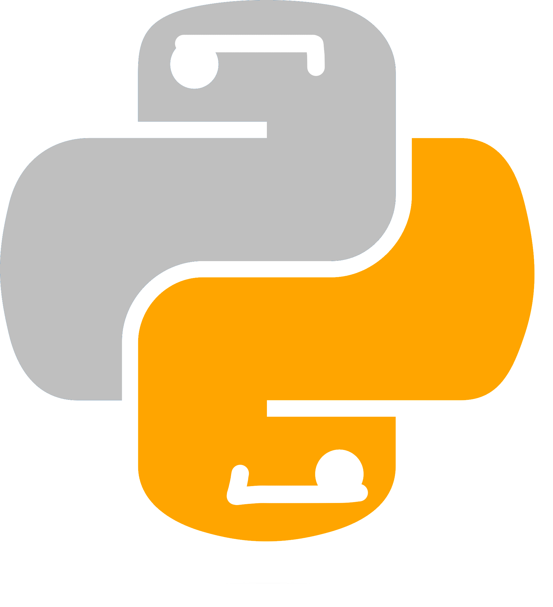

<h1 align="center">🐍Pythoscate</h1>


<br>

<div align="center" id="top"> 
  
</div>

<h1 align="center">✨Features</h1>

⚙️ 3 different encodings<br><br>
🛠️ Encodes 10 different times (Total of 30 layers of security)<br><br>
🔧 Keeps good performance/doesn't add lag to your Python files<br><br>
❌ No dependencies are needed<br><br>
🤖 Resistant to programs and AI<br><br>


<h1 align="center">📦Installation and Usage</h1>

1. Download the [latest release](https://github.com/ACaracalCat/Pythoscate-Obfuscation/releases)
2. Download [Python 3.6](https://python.org/) or higher
3. Run the following in a terminal/command line
```bash
  cd <path-to-pythoscates-folder>
  python main.py
```
